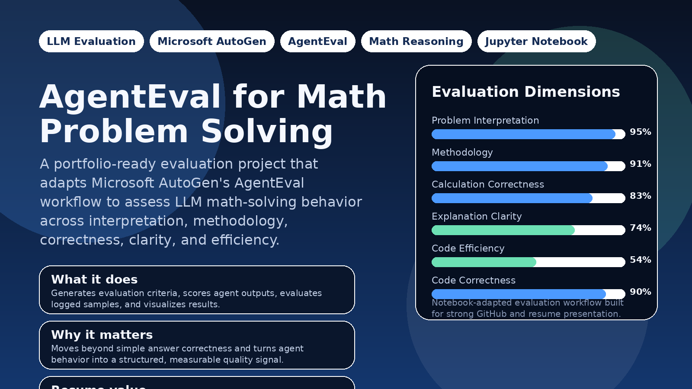
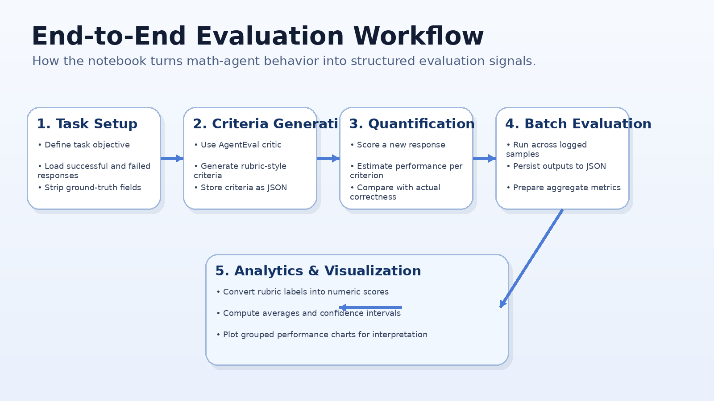
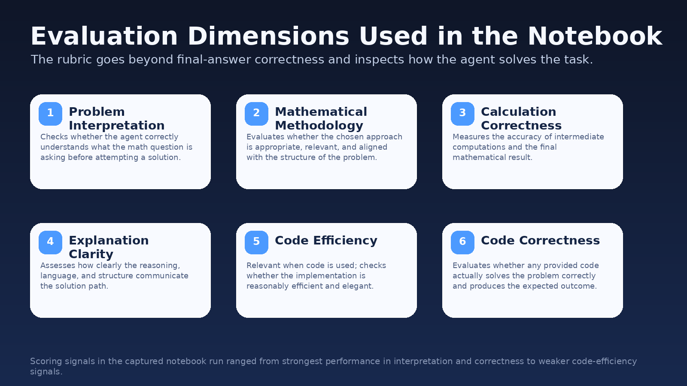
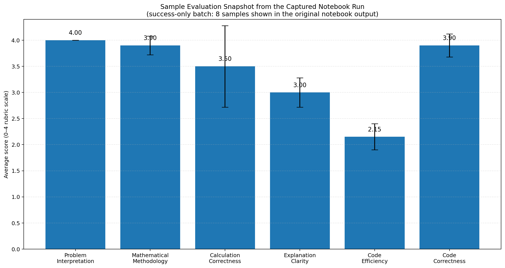
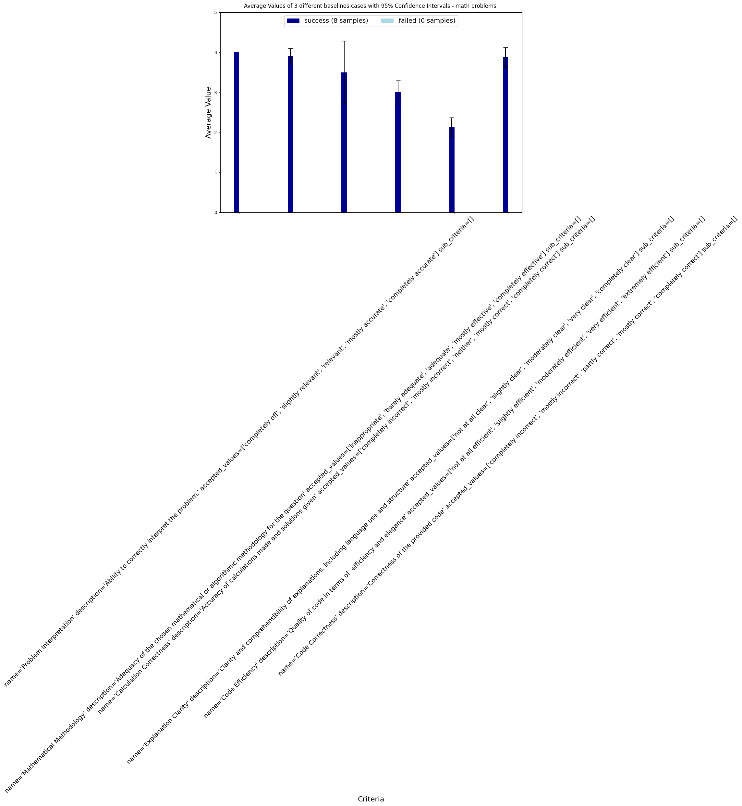

# AgentEval for Math Problem Solving



<p align="center">
  
  
  
  
  
</p>

## Overview

This project adapts **Microsoft AutoGen's AgentEval workflow** to evaluate the behavior of a **math problem-solving agent** in a more structured way than simple right-or-wrong grading.

Instead of checking only whether the final answer is correct, the notebook evaluates how the agent performs across dimensions such as:

- problem interpretation
- mathematical methodology
- calculation correctness
- explanation clarity
- code efficiency
- code correctness

The result is a more complete view of **LLM quality, reasoning behavior, and response usefulness**.

---

## Why this project is worth showing on GitHub

This repository is strong portfolio material because it demonstrates more than notebook execution. It shows how to:

- frame an evaluation problem around real agent behavior
- convert qualitative judgment into reusable criteria
- quantify responses with rubric-based scoring
- batch-score multiple logged interactions
- summarize performance visually for non-technical readers
- document an experiment in a way that recruiters and hiring managers can understand quickly

For resumes, this positions the project at the intersection of:

- LLM evaluation
- agentic AI workflows
- experiment design
- Python-based data processing
- technical communication

---

## What the notebook does

1. **Defines a math-solving evaluation task**
   - Uses one successful example and one failed example as reference behaviors.

2. **Generates evaluation criteria**
   - Uses the AgentEval critic to create criteria automatically for the math problem-solving use case.

3. **Quantifies a new sample**
   - Scores a test case against the generated criteria and estimates its performance.

4. **Runs evaluation over multiple logs**
   - Iterates through logged samples and stores the evaluation outputs.

5. **Aggregates performance**
   - Converts rubric labels into numeric values, computes averages, and estimates confidence intervals.

6. **Visualizes results**
   - Produces charts to compare criterion-level performance across evaluated cases.

---

## Evaluation workflow



The notebook follows a clean evaluation pipeline:

**Task setup → Criteria generation → Response quantification → Batch evaluation → Aggregation and visualization**

This is valuable because it mirrors the structure of real-world evaluation systems used for AI products and internal model benchmarking.

---

## Evaluation dimensions



These dimensions are especially useful for math-solving agents because they reveal whether a model:

- understood the question correctly
- selected a valid solution strategy
- computed the answer accurately
- explained the reasoning clearly
- used code appropriately when code was part of the answer

That makes the project more compelling than a basic “accuracy-only” benchmark.

---

## Sample output visualizations

### Reformatted performance snapshot



### Original chart captured from the notebook output



The captured run in the notebook shows strong signals in **problem interpretation**, **methodology**, and **code correctness**, while **code efficiency** appears comparatively weaker. Even from a small run, this demonstrates how rubric-based evaluation can surface strengths and weaknesses that would be hidden by a single binary correctness score.

---

## Tech stack

- **Python**
- **Jupyter Notebook**
- **Microsoft AutoGen / AgentEval**
- **NumPy**
- **SciPy**
- **Matplotlib**
- **JSON-based evaluation artifacts**

---

## Repository structure

```text
.
├── agenteval_cq_math.ipynb
├── README.md
└── assets
    ├── banner.png
    ├── pipeline_overview.png
    ├── evaluation_dimensions.png
    ├── performance_snapshot.png
    ├── notebook_generated_chart.png
    └── social_preview.png
```

---

## How to run

### 1. Install dependencies

```bash
pip install "autogen-agentchat~=0.2" docker
pip install scipy matplotlib numpy
```

### 2. Configure your model endpoint

The notebook uses:

```python
config_list = autogen.config_list_from_json("OAI_CONFIG_LIST")
```

So you should provide an `OAI_CONFIG_LIST` configuration in the format expected by AutoGen.

### 3. Open and run the notebook

Run the notebook cells in order:

- load imports and configuration
- build the math-solving task
- generate criteria
- quantify a single test case
- evaluate a folder of logged samples
- visualize aggregated performance

---

## Methodology deep dive

### 1. Task framing

The notebook creates a `Task` object for **math problem solving**, with:

- a task name
- a task description
- one successful response example
- one failed response example

This is important because AgentEval uses contrastive examples to infer what “good” and “bad” behavior look like for the domain.

### 2. Ground-truth stripping

Before scoring, the notebook removes fields such as:

- `is_correct`
- `correct_ans`
- `check_result`

This helps prevent label leakage and keeps the evaluator focused on the response content rather than hidden answer metadata.

### 3. Criteria generation

The notebook calls `generate_criteria(...)` to produce rubric-style dimensions tailored to the task. That means the evaluation is **task-aware** rather than hard-coded.

### 4. Quantification

The `quantify_criteria(...)` step scores a response against the generated rubric and estimates success across multiple dimensions.

This is the core of the project because it transforms open-ended LLM output into structured measurement.

### 5. Batch log evaluation

The notebook then loops through logged JSON files and scores each case. The resulting outputs are stored in an evaluation artifact file for later analysis.

### 6. Statistical summarization

Finally, rubric labels are mapped to numeric values so the project can compute:

- average criterion scores
- confidence intervals
- comparative performance plots

That makes the final results easier to explain in GitHub, presentations, or interviews.

---

## Key engineering and portfolio takeaways

This project demonstrates the ability to:

- adapt an existing research/demo workflow into a clearer portfolio artifact
- make LLM behavior measurable and interpretable
- combine agent frameworks with evaluation logic
- build a reproducible analysis pipeline around notebook experiments
- communicate technical work with professional visuals and structured documentation

---
